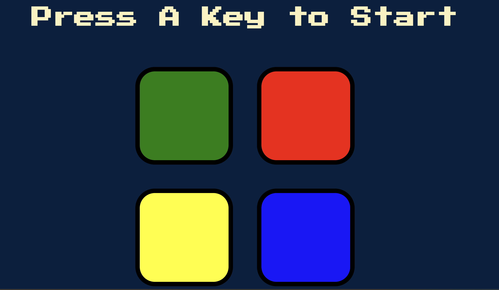

# 🧠 Simon Game 🎮

A simple memory game built with HTML, CSS, JavaScript, and jQuery where you follow the color pattern shown by the game.

## 📸 Preview

## 🚀 Features

- Random pattern generation
- Sound and button animation
- Game over + restart logic
- Keyboard-triggered start
- Fully responsive

## 🎮 How to Play

1. Press any key to start the game.
2. Repeat the pattern shown by the game.
3. Each level adds one more step to the pattern.
4. If you click the wrong color, the game ends.

## 🛠️ Built With

- HTML
- CSS
- JavaScript
- jQuery

